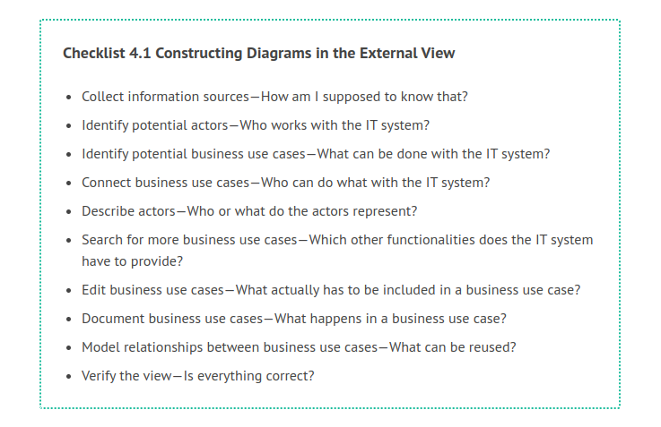
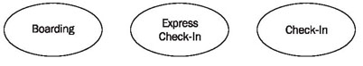
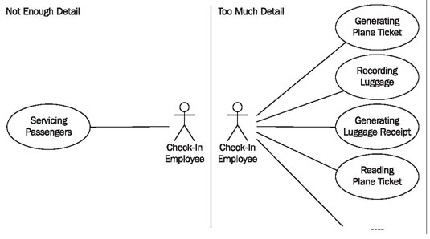
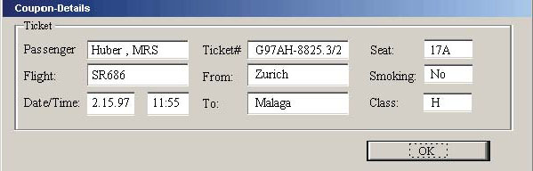
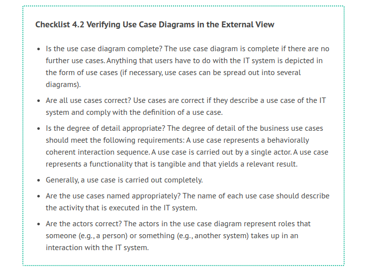
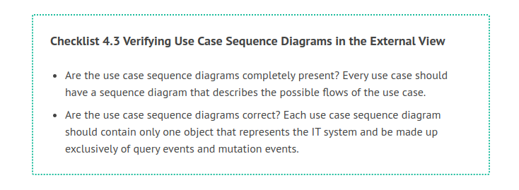

# Constructing the External View

The following checklist shows the steps necessary to construct the external view. Subsequently, we will explain the individual steps further.

The order in which these steps are given makes sense. However, this order is not mandatory, since in practice, the individual steps often overlap heavily.

Normally, these steps will be carried out by an analyst, who needs to have a general understanding of the IT system as well as of the business system as it was modeled in Modeling Business Systems. However, it is indispensable to consult additional knowledge carriers, such as users of the system. The result of these work steps is the external view, which has to be read and understood by domain experts.

## Collect Information Sources—How Am I Supposed to Know That?

Generally, there are quite a number of information sources that can be used for the formulation of the external view:

 * Certainly, the business system model is the first source that should be drawn upon. The business system’s actors, workers, and use cases are a good starting point from which it is possible to derive actors and use cases of the IT system (see Modeling Business Systems).
 * Technical specifications, project specifications, and similar documents.
 * Future users are a very important source for this user-oriented external view.
 * Technical experts in the IT system’s area of application.
 * Organization charts, organizational structure, and job descriptions.
 
Taking up the users’ standpoint is very helpful. Talk with users or observe them performing their jobs.

## Identify Potential Actors—Who Works with the IT System?

This step is about identifying a first selection of actors. This selection does not yet have to be complete or correct. The rule applies: the more, the better. You can continue working with these actors in subsequent steps.

Answering the following questions (for instance, with users of the system) will help identify potential actors. While doing this, you should try to abstain from using persons mentioned by name. Instead, try to form groups of people or actors:

 * Which actors and employees of the business system deal directly with the IT system?
 * Which groups of people need support from the IT system in order to complete their daily work?
 * Which groups of people perform the most important main functions of the IT system?
 * Which groups of people are needed to carry out secondary system functions, such as maintenance and administration?
 * Which groups of people from the organization model (see organization chart) of the company or division work with the IT system?

Here, it is important to picture concrete and direct interactions with the IT system under consideration.

At a check-in counter it is the check-in employee who is in direct interaction with the IT system. At the check-in machine, where passengers without luggage can check in with their machine-readable tickets, it is the passenger who directly interacts with the IT system, inserting the ticket and choosing one of the empty seats.

A passenger is also an actor in the business system; check-in employees and boarding employees, on the other hand, are not. They are employees, and because of that, they are part of the business system, as shown in Figure 4.15:

	Figure 4.15 Potential actors
	
## Identify Potential Use Cases—What Can be Done With the IT System?

This step is about finding a first selection of use cases. Here too, the rule applies: the more, the better. Answering the following questions will help identify potential use cases:

 * Which business use cases of the business system are supported by the IT system?
 * Which business activities of the business system should be supported by the IT system?
 * Depending on the degree of detail of the business activities, in this step a use case can be constructed for each business activity.
 * What are the goal and purpose of the IT system?
 * What are the main functions of the IT system?
 * For what do actors need the IT system?
 * Which secondary system functions, such as maintenance and administration, does the IT system require?
 * What functions does the interface prototype have?
 

 
## Connect Actors and Use Cases—Who Can Do What with the IT System?

Assigning business use cases to actors generates a first draft of the use case diagram, as shown in Figure 4.16. Here, the following question should be answered:

Which actor can carry out which use cases?

 

	Figure 4.17 First draft of a use case diagram
	
This first draft constitutes a foundation from which the use case diagram can be edited and refined, as shown in Figure 4.17.

## Describe Actors—Who or What do the Actors Represent?

An actor in a diagram has to be named (or renamed) in a way that clarifies the role that is represented. The question is:

How can an actor be accurately described? Here it is extremely important that the terminology of the domain is used. Users of the IT system have to recognize themselves in the actors; otherwise they will not understand the use case diagram! If required, the actor can be defined with a comment in addition to an accurate name. Such a comment can include the field of responsibility of the actor, the requirements of the IT system from the actor’s perspective, or a formal definition of the role that the actor plays.

## Search for More Use Cases—What Functionalities does the IT System have to Provide?

Once you have identified a first selection of use cases, these can be used as the starting point for the completion of the use case diagram. Use cases that were overlooked before can be identified by asking the following questions, based on a particular use case:

 * Is there anything that has to be done with the IT system at some point before a particular use case can be executed??
 * Is there anything that has to be done with the IT system at some point after a particular use case is executed?
 * Is there anything that has to be done with the IT system if it does not execute a particular use case?

It is very important not to lose sight of the real IT system. There is a risk of modeling use cases that lie outside the IT system under consideration. For example, purchasing the plane ticket, which has to occur before check-in, does not belong to the considered IT system passenger services.

In our case study, the answers for the use case check-in could be as follows:

 * Information about ticket and flight has to be obtained before check-in.
 * Boarding has to take place after check-in.
 * The plane ticket has to be invalidated if the passenger does not appear at check-in.
 
## Edit Use Cases—What Actually Has to be Included in a Use Case?

The most difficult part of modeling use cases probably is finding the appropriate degree of detail for these use cases. Here, the range is between the two extremes shown in Figure 4.18:

	Figure 4.18 Extreme degrees of detail in the IT system “Passenger Services”
	
Neither approach makes sense. If the entire IT system is crammed into one use case, a practically meaningless use case diagram is constructed. Nothing useful can be learned from it. If on the other hand, use cases are itemized too strongly, the use case diagram gets too complex and contains too many use cases with interrelationships that are hard to recognize.

Fortunately, there are some criteria that will help you find the optimal scope of a use case. To prevent use cases from becoming too large, we can ask the following questions for each use case:

 * Does the use case consist of a behaviorally related sequence of interactions that belong together (an interaction sequence)? Items that are included in a business use case have to be directly related. Issuing a boarding pass and searching for lost luggage are not related at all. Use cases that violate this criterion have to be divided.

 * Can a single actor carry out the use case? Even though UML allows more than one actor to be involved in the execution of a use case, in most cases, it is better to abstain from this option. If a use case describes the interaction of a person with a computer, it implies that not more than one person should be involved in the interaction. Use cases that violate this criterion have to be divided.

To avoid the creation of use cases that are too small, we can ask the following questions for each use case:

 * Does the use case deliver a tangible and relevant result? A use case cannot describe an incomplete sub-step by itself, such as choose customer. Rather, a use case has to produce a result that makes sense from a domain point of view. Use cases that violate this criterion have to be combined with other use cases.
 
 * Is the use case never performed alone, but always in a sequence in combination with other business use cases? Use cases are not supposed to describe sub-steps that are only executed in combination with other sub-steps. Use cases that violate this criterion have to be combined with other use cases.

Verifying existing use cases with these questions can help finding a meaningful degree of detail by dividing or combining use cases.

## Document Use Cases—What Happens in a Use Case?

The information from the use case diagram is not sufficient to understand use cases. The flow of interaction that stands behind a use case has to be described. In addition to purely verbal description, description in a use case sequence diagram has proven to be especially valuable. We can ask the following questions when developing a use case sequence diagram for the use case:

 * What steps are involved in working with the IT system? To answer this question we have to observe the actor’s work with the IT system. What does the actor do with the IT system? What does he or she enter? What does the IT system display? What does the interaction look like? Here, it is important to find the appropriate level of detail. Not every key pressed makes up a work step. The next two questions will help you find the appropriate level of detail.
 
 * Which information is the use case meant to provide to the actor? If information should be displayed, a query event is sent to the IT system.
 
 * Which information is meant to be stored, modified, or deleted in the IT system? If information should be changed, a mutation event is sent to the IT system.

The description of the flow is, therefore, a succession of steps in which information is entered or queried, in other words, an interaction. During the description of the flow, the IT system is always viewed as a black box.Because, in reality, a use case does not always take place in the same manner, it has proven valuable to use simple control structures in descriptions to show alternatives and branches, as illustrated in Figure 4.19:

	Figure 4.19 Use case sequence diagram for the use case “Boarding”
	
The documentation of use cases should also include a description of the user interface utilized. An example of this is the dialogue window labeled [B27] above, shown in Figure 4.20:

	Figure 4.20: Dialog window [B 27] from the use case “Boarding”
	
## Model Relationships between Use Cases—What can be Reused?

If you notice that certain parts of the interaction are the same in several use cases, these commonalities can be included into their own use case. With an include relationship this new use case can be utilized in other use cases. The question for this is:

Are there parts or sections that exist in several use case sequence diagrams (and always remain the same)?

## Verify the View—Is Everything Correct?

Use case diagrams, as well as use case sequence diagrams, have to be verified with the aid of knowledge carriers. Ideally, knowledge carriers can read and understand the diagrams themselves (which is not that difficult, since our book has reading instructions for every view). Then, the knowledge carriers are in a position to answer the question about completeness and correctness themselves. If this is not possible, the diagrams have to be read to the knowledge carriers. Then, the diagrams have to be verified for correctness and completeness jointly. Only with this last step is the circle complete and a verified view that reflects a current shared understanding of the IT system created.

The completed use case diagram can be verified with the following checklist:

Completed use case sequence diagrams can be verified with the following checklist:

