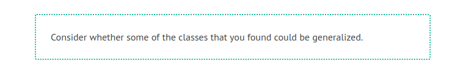
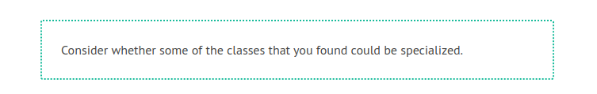

# Generalization, Specialization, and Inheritance

Terms such as superclass, subclass, or inheritance come to mind when thinking about the object-oriented approach. These concepts are very important when dealing with object-oriented programming languages such as Java, Smalltalk, or C++. For modeling classes that illustrate technical concepts they are secondary. The reason for this is that modeling relevant objects or ideas from the real world gives little opportunity for using inheritance (compare the class diagram of our case study). Nevertheless, we would like to further introduce these terms at this point in Figure 4.26:

	Figure 4.26 Notation of generalization

Generalization is the process of extracting shared characteristics from two or more classes, and combining them into a generalized superclass. Shared characteristics can be attributes, associations, or methods.

In Figure 4.27, the classes Piece of Luggage (1) and Piece of Cargo (2) partially share the same attributes. From a domain perspective, the two classes are also very similar. During generalization, the shared characteristics (3) are combined and used to create a new superclass Freight (4). Piece of Luggage (5) and Piece of Cargo (6) become subclasses of the class Freight.

The shared attributes (3) are only listed in the superclass, but also apply to the two subclasses, even though they are not listed there.

	Figure 4.27 Example of generalization
	

In contrast to generalization, specialization means creating new subclasses from an existing class. If it turns out that certain attributes, associations, or methods only apply to some of the objects of the class, a subclass can be created. The most inclusive class in a generalization/specialization is called the superclass and is generally located at the top of the diagram. The more specific classes are called subclasses and are generally placed below the superclass.

In Figure 4.28, the class Freight (1) has the attribute Degree of Hazardousness (2), which is needed only for cargo, but not for passenger luggage. Additionally (not visible in Figure 4.28), only passenger luggage has a connection to a coupon. Obviously, here two similar but different domain concepts are combined into one class. Through specialization the two special cases of freights are formed: Piece of Cargo (3) and Piece of Luggage (4). The attribute Degree of Hazardousness (5) is placed where it belongs—in Piece of Cargo. The attributes of the class Freight (1) also apply to the two subclasses Piece of Cargo (3) and Piece of Luggage (4):

	Figure 4.28 Example of specialization
	

So much for the mechanism. However, the domain meaning of the relationship between superclass and subclass is much more important. These rules apply to this relationship:

 * All statements that are made about a superclass also apply to all subclasses. We say that subclasses “inherit” attributes, associations, and operations from the superclass. For example: If the superclass Freight has an attribute Weight, then the subclass piece of luggage also has an attribute Weight, even though this attribute is not listed in the subclass Piece of Luggage.
 
 * Anything that can be done with an object of the superclass can also be done with an object of the subclass. For example: If freight can be loaded, pieces of luggage can also be loaded.

 * In the terminology of the system that is being modeled, a subclass has to be a special form of the superclass. For example: A piece of luggage is a special case of freight. The counter-example to this is: A flight is not a special case of a flight number.

