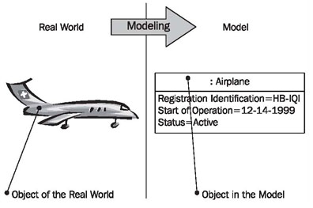
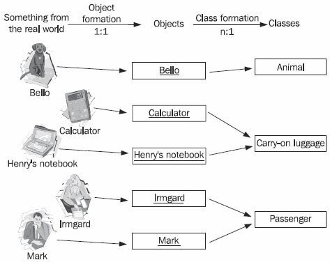
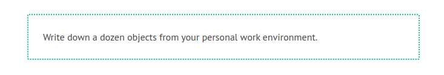

# Objects and Classes

The basis of the object-oriented approach is as good as possible a representation of something that exists in the real world first in a model and later in an IT system. However, this representation will never completely correspond to reality. Everything in the real world, whether it is a living being, an object, or an idea, is so complex and has so many aspects, that this complexity can never be completely represented:

	Figure 4.21 A few aspects of Mr. Smith
	
To allow representation as a model it is necessary to focus on a few particular aspects and to leave out all others. The essential, meaning the interesting, aspects are emphasized and all other aspects are omitted. It is exactly this that is the art of modeling objects.

In order to model objects successfully we have to know for what purpose they are needed in the IT system. The object “Mr. Smith” will look different in a customer management system than in a medical information system or in a tax register (see Figure 4.21). Only when we know, at least approximately, the purpose of the IT system we can build functional objects.

In models, we always abstract from reality in a target-oriented manner. We restrict our consideration to the important aspects for the current purpose and omit everything else. Figure 4.22 shows this step of abstraction by the example of an airplane:

	Figure 4.22 Modeling
	
When depicting the real world in abstract models, we differentiate between two steps. In the first step, we abstract from individual persons or things to objects. In the second step, we combine similar objects into classes. Figure 4.23 shows, with a few examples, how things of the real world are depicted first as objects and then as classes:

	Figure 4.23 Object and Class formation
	
The direct illustration in a model of something that exists in the real world leads to an object. A 1:1 relationship exists between something from the real world and the object. The object represents exactly one particular exemplar from the real world. In a database an object corresponds, for instance, to an entry in a spreadsheet. The definition of objects is already a first step of abstraction, since only relevant features are modeled in the object. For example, in the object Mark, the person Mark is reduced to those aspects that are important for a passenger, for instance, title, first name, last name, and date of birth.

In the second step of abstraction, we combine similar objects into classes. Similar means:

 * That the goal of the abstraction is similar
 * That we are interested in similar characteristics
 * That the objects have similar behavior

Most of the time the two steps of abstraction are combined, meaning that classes are formed directly. The step of object creation is not carried out explicitly.

Modeling is often made more difficult by the fact that something that only exists as a concept or idea, and not in the physical sense, has to be modeled. While in the past it was still possible to actually hold a stock certificate or a savings book in your hands, today, such things often exist only as information.

Dealing with classes becomes easier when you consider that the term class has two somewhat different meanings:

 * On the one hand, the class is the pattern according to which objects are created.
 * On the other hand, the class is the set of objects that have been created according to that class.

The class as a pattern dictates the characteristics and behavior of objects that are created from the class. In Figure 4.24, class is compared with a cookie cutter, which can be used to cut cookies (objects of the class) from dough:

	Figure 4.24 Cookies, classes, and objects

	Figure 4.25 Class as a pattern

The class as a set contains and knows all its objects. It can be pictured as a table in a database, which knows all its entries.

Usually, classes, in addition to attributes, contain methods, which specify the behavior of objects. However, in our approach to modeling IT systems we broadly abstain from using this possibility. The behavior of objects depends largely on their respective states. A “cancel flight” method of the class “flight”, for instance, has to perform something different with a flight object in the condition “in execution” than with a flight object in the condition “planned”.

According to our experience, such rules can generally be modeled much more easily in the statechart diagram in the behavioral view than they can be modeled with operations. Only in the later project stages of design and implementation is the behavior of classes converted into methods according to the programming language utilized.

In the Hanseatic merchant’s trading office a class corresponds to a book, for example a customer index, and the clerk who is responsible for the book. The book can only be accessed through the clerk. Individual customer entries correspond to the objects. Entries in the different books are connected by cross-references.

