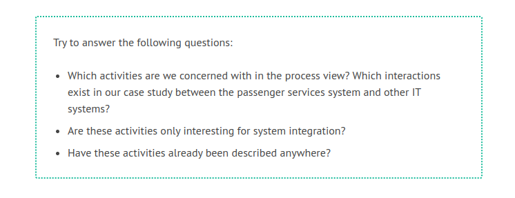

# Process View

The process view depicts those activities that an IT system passes through when it exchanges messages with other IT systems. Purely technical processes that are necessary for communication between IT systems, such as dial-up or other connection to the Internet, are not the subject of the process view of our model.

