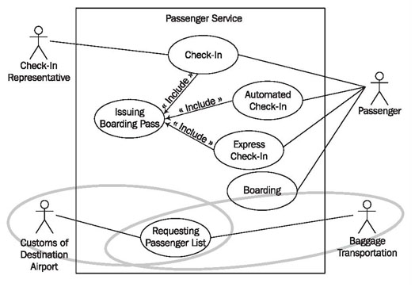

# The Business System Model as Foundation

The exchange of messages between IT systems occurs on the basis of business events. Therefore, the exchange of messages is an activity of a subordinate business process.

In the business system model from our case study, the IT system that needs to be integrated is located within the business system passenger services (see Figure 5.2):

	Figure 5.2 Integration of IT system
	
From the business processes in and around the passenger services business system, all of those business processes that require an interaction between the IT system of our business system and other IT systems are selected. The diagrams constructed for various views of the business model can be used as the foundation for integration.

For the integration with IT systems that belong to the same business as the IT system under consideration in our case study passenger services, we use diagrams of the internal view of the business system.

For interactions with IT systems that are located outside the business system, we use the diagrams of the external view of the business system. Here, it is not important whether the external IT systems belong to the same organization or not. For details of the process we can refer to the diagrams of the internal view of the business system.

In our case study we selected two interfaces:

<b>Passenger list to customs:</b> For each flight a passenger list is sent to customs at the destination airport. Each passenger and each crew member is individually mentioned on this list. The transfer of the data takes place through the sending system some time between departure of the plane and arrival at the destination airport. This enables customs at the destination airport to verify the data and to make timely decisions regarding clearance of passengers and crew.

<b>No boarding:</b> Ten minutes before estimated time of departure (ETD), the procedure no boarding is initiated. This means that ten minutes before EDT, triggered by a timer, baggage transportation requests a passenger list for the corresponding flight. On the passenger services side, the desired passenger list is generated on the receipt of this event. This list specifies all passengers who have not yet boarded the airplane. Once all the luggage of the passengers specified on this list has been unloaded, passenger services receive the passenger list back from baggage transportation, with the appropriate confirmations.

Figure 5.3 shows the use case diagram from <b>Modeling Business Systems</b>, (<a href="/uml/modeling-business-systems/external-view/use-case-diagrams

#f3.14">Figure 3.14), which forms the base diagram for the two marked business use cases.

Both examples include activities from the business use case requesting passenger list. The first example, passenger list to customs, describes the interaction between our business system passenger services and the actor customs of destination airport, which is marked on the business use case diagram:

	Figure 5.3 Use case diagram of the business system “Passenger Services”
	
The second example describes the interaction between our business system passenger services and the actor baggage transportation, which is also marked on the business use case diagram.

For the description of the process view between involved IT systems, we use the activity diagram and the sequence diagram. For the explanation of the activity diagram and the sequence diagram and for the instructions on reading diagrams we use the example passenger list to customs; for the construction of the diagrams, we use the example no boarding.
