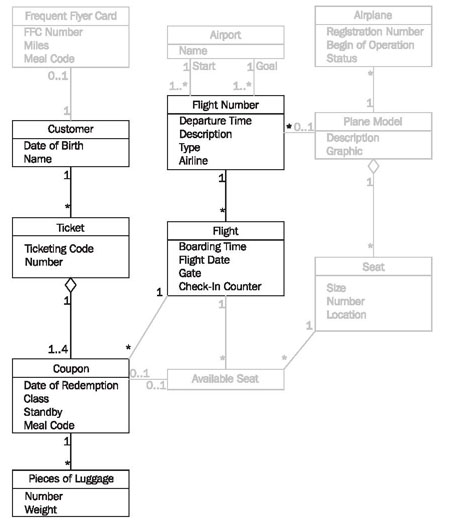
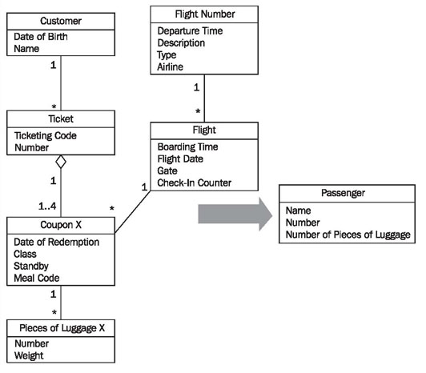

# Transforming Data from the IT System to the Message "passenger list"

On the basis of the available class diagrams of passenger services and the message passenger list, we will explain the necessary steps for selecting and transforming data concerning flight and passengers.

In Figure 5.22, we have emphasized the classes needed for the transformation of flight and passenger data, or rather, de-emphasized the classes of the diagram that we do not need:

	Figure 5.22 Class diagram of “Passenger Services”
	
## Transformation of Flight Data

We can see in Figure 5.23 that a flight has n corresponding flights. The multiplicity of the class flight is insignificant, since we are only interested in an exactly 1:1 relationship for each message—meaning, we are only interested in one single flight at a time. In the business object, the two classes of the IT system can be combined to one class, and attributes relevant for the business object can be adopted:

	Figure 5.23 Transforming flight number/flight to the business object class “Flight”
	
To obtain the correct message data from the IT system, we have to indicate the day of the desired flight as selection criterion in addition to the flight number.

## Transformation of Passenger Data

	Figure 5.24 Transforming to the business object class passenger
	
For the transformation of passenger data to the message passenger list, we need many more steps than we did for the flight data.

Define which data is needed:

 * customer.name
 * ticket.number
 * count (piece of luggage)

Regulations define how the correct data can be read out of the IT system. In addition to the rules about how to read the necessary data from the various classes, we have to ensure that only passengers who belong on the selected flight, and who also are on board this flight, are listed.

